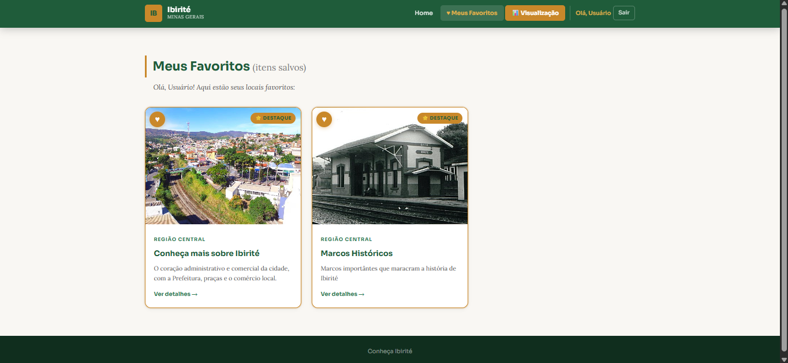
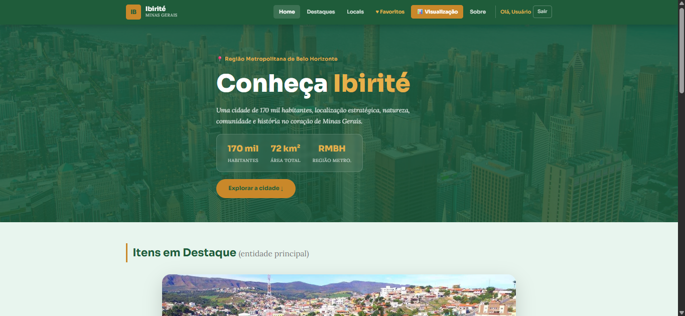
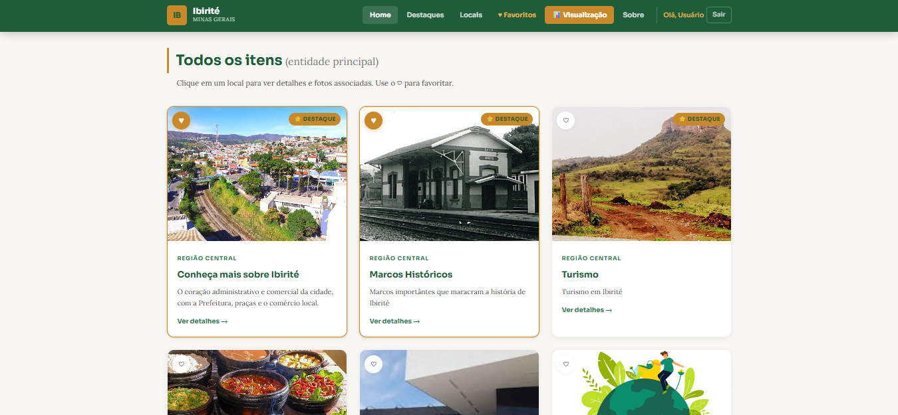

# SEMANA-15

## Informações Gerais

- Nome: Camila Victoria de Barros
- Matricula: 1659655
- Proposta de projeto escolhida: Lugares e Experiências
- Breve descrição sobre seu projeto: Estou criando um projeto sobre minha cidade, como se fosse um turismo digital

## Descrição do Projeto

Site estático e responsivo que apresenta os principais locais turísticos, históricos e culturais do município de Ibirité – MG, localizado na Região Metropolitana de Belo Horizonte. Os dados são manipulados via JavaScript com estrutura JSON e renderizados dinamicamente nas páginas.

Esta versão inclui integração do módulo de login de usuário e funcionalidade de favoritos personalizados por usuário.

## Prints

